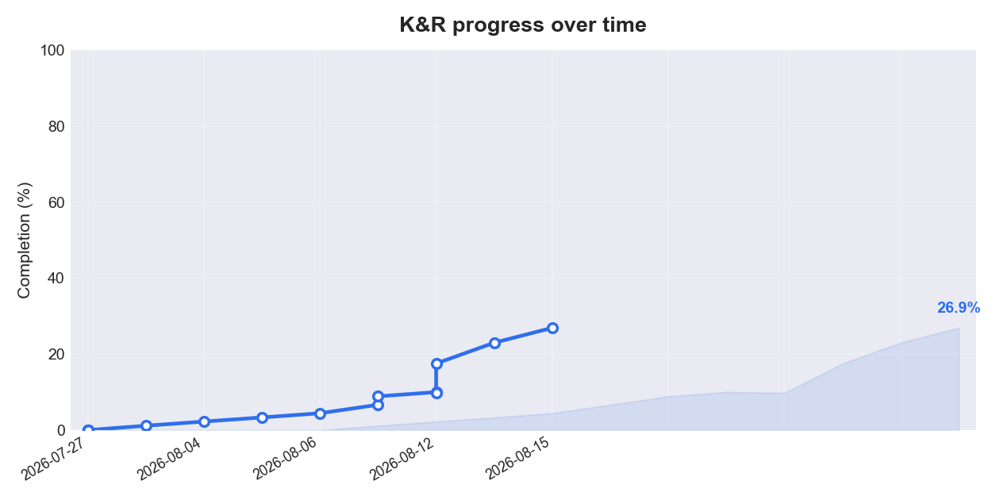

# Progress Tracker

Auto-generated by `scripts/update_tracker.py`. Do not edit by hand.

_Last updated: 2026-08-15_

## Overall

**26.9% complete** `[######------------------]`

| Metric | Done | Total |
| --- | --- | --- |
| Section notes | 9 | 77 |
| Chapter summaries | 0 | 8 |
| Exercises solved | 19 | 19 |

## Progress over time

## By chapter

| Chapter | Notes | Summary | Exercises |
| --- | :---: | :---: | :---: |
| 1. A Tutorial Introduction | 9 / 10 | - | 19 / 19 |
| 2. Types, Operators and Expressions | 0 / 12 | - | 0 / 0 |
| 3. Control Flow | 0 / 8 | - | 0 / 0 |
| 4. Functions and Program Structure | 0 / 11 | - | 0 / 0 |
| 5. Pointers and Arrays | 0 / 12 | - | 0 / 0 |
| 6. Structures | 0 / 9 | - | 0 / 0 |
| 7. Input and Output | 0 / 8 | - | 0 / 0 |
| 8. The UNIX System Interface | 0 / 7 | - | 0 / 0 |

**Legend (Summary column):** `yes` = summary written, `no` = all sections in the chapter are done but the summary is not written yet, `-` = chapter not finished yet so no summary is expected.

## By subsection

### Chapter 1 - A Tutorial Introduction

| Section | Title | Notes | Summary | Exercises |
| :---: | --- | :---: | :---: | :---: |
| 1.1 | Getting Started | yes | - | 2 / 2 |
| 1.2 | Variables and Arithmetic Expressions | yes | - | 2 / 2 |
| 1.3 | The for statement | yes | - | 1 / 1 |
| 1.4 | Symbolic Constants | yes | - | 0 / 0 |
| 1.5 | Character Input and Output | yes | - | 7 / 7 |
| 1.6 | Arrays | yes | - | 2 / 2 |
| 1.7 | Functions | yes | - | 1 / 1 |
| 1.8 | Arguments - Call by Value | yes | - | 0 / 0 |
| 1.9 | Character Arrays | yes | - | 4 / 4 |
| 1.10 | External Variables and Scope | - | - | 0 / 0 |

### Chapter 2 - Types, Operators and Expressions

| Section | Title | Notes | Summary | Exercises |
| :---: | --- | :---: | :---: | :---: |
| 2.1 | Variable Names | - | - | 0 / 0 |
| 2.2 | Data Types and Sizes | - | - | 0 / 0 |
| 2.3 | Constants | - | - | 0 / 0 |
| 2.4 | Declarations | - | - | 0 / 0 |
| 2.5 | Arithmetic Operators | - | - | 0 / 0 |
| 2.6 | Relational and Logical Operators | - | - | 0 / 0 |
| 2.7 | Type Conversions | - | - | 0 / 0 |
| 2.8 | Increment and Decrement Operators | - | - | 0 / 0 |
| 2.9 | Bitwise Operators | - | - | 0 / 0 |
| 2.10 | Assignment Operators and Expressions | - | - | 0 / 0 |
| 2.11 | Conditional Expressions | - | - | 0 / 0 |
| 2.12 | Precedence and Order of Evaluation | - | - | 0 / 0 |

### Chapter 3 - Control Flow

| Section | Title | Notes | Summary | Exercises |
| :---: | --- | :---: | :---: | :---: |
| 3.1 | Statements and Blocks | - | - | 0 / 0 |
| 3.2 | If-Else | - | - | 0 / 0 |
| 3.3 | Else-If | - | - | 0 / 0 |
| 3.4 | Switch | - | - | 0 / 0 |
| 3.5 | Loops - While and For | - | - | 0 / 0 |
| 3.6 | Loops - Do-While | - | - | 0 / 0 |
| 3.7 | Break and Continue | - | - | 0 / 0 |
| 3.8 | Goto and labels | - | - | 0 / 0 |

### Chapter 4 - Functions and Program Structure

| Section | Title | Notes | Summary | Exercises |
| :---: | --- | :---: | :---: | :---: |
| 4.1 | Basics of Functions | - | - | 0 / 0 |
| 4.2 | Functions Returning Non-integers | - | - | 0 / 0 |
| 4.3 | External Variables | - | - | 0 / 0 |
| 4.4 | Scope Rules | - | - | 0 / 0 |
| 4.5 | Header Files | - | - | 0 / 0 |
| 4.6 | Static Variables | - | - | 0 / 0 |
| 4.7 | Register Variables | - | - | 0 / 0 |
| 4.8 | Block Structure | - | - | 0 / 0 |
| 4.9 | Initialization | - | - | 0 / 0 |
| 4.10 | Recursion | - | - | 0 / 0 |
| 4.11 | The C Preprocessor | - | - | 0 / 0 |

### Chapter 5 - Pointers and Arrays

| Section | Title | Notes | Summary | Exercises |
| :---: | --- | :---: | :---: | :---: |
| 5.1 | Pointers and Addresses | - | - | 0 / 0 |
| 5.2 | Pointers and Function Arguments | - | - | 0 / 0 |
| 5.3 | Pointers and Arrays | - | - | 0 / 0 |
| 5.4 | Address Arithmetic | - | - | 0 / 0 |
| 5.5 | Character Pointers and Functions | - | - | 0 / 0 |
| 5.6 | Pointer Arrays; Pointers to Pointers | - | - | 0 / 0 |
| 5.7 | Multi-dimensional Arrays | - | - | 0 / 0 |
| 5.8 | Initialization of Pointer Arrays | - | - | 0 / 0 |
| 5.9 | Pointers vs. Multi-dimensional Arrays | - | - | 0 / 0 |
| 5.10 | Command-line Arguments | - | - | 0 / 0 |
| 5.11 | Pointers to Functions | - | - | 0 / 0 |
| 5.12 | Complicated Declarations | - | - | 0 / 0 |

### Chapter 6 - Structures

| Section | Title | Notes | Summary | Exercises |
| :---: | --- | :---: | :---: | :---: |
| 6.1 | Basics of Structures | - | - | 0 / 0 |
| 6.2 | Structures and Functions | - | - | 0 / 0 |
| 6.3 | Arrays of Structures | - | - | 0 / 0 |
| 6.4 | Pointers to Structures | - | - | 0 / 0 |
| 6.5 | Self-referential Structures | - | - | 0 / 0 |
| 6.6 | Table Lookup | - | - | 0 / 0 |
| 6.7 | Typedef | - | - | 0 / 0 |
| 6.8 | Unions | - | - | 0 / 0 |
| 6.9 | Bit-fields | - | - | 0 / 0 |

### Chapter 7 - Input and Output

| Section | Title | Notes | Summary | Exercises |
| :---: | --- | :---: | :---: | :---: |
| 7.1 | Standard Input and Output | - | - | 0 / 0 |
| 7.2 | Formatted Output - printf | - | - | 0 / 0 |
| 7.3 | Variable-length Argument Lists | - | - | 0 / 0 |
| 7.4 | Formatted Input - Scanf | - | - | 0 / 0 |
| 7.5 | File Access | - | - | 0 / 0 |
| 7.6 | Error Handling - Stderr and Exit | - | - | 0 / 0 |
| 7.7 | Line Input and Output | - | - | 0 / 0 |
| 7.8 | Miscellaneous Functions | - | - | 0 / 0 |

### Chapter 8 - The UNIX System Interface

| Section | Title | Notes | Summary | Exercises |
| :---: | --- | :---: | :---: | :---: |
| 8.1 | File Descriptors | - | - | 0 / 0 |
| 8.2 | Low Level I/O - Read and Write | - | - | 0 / 0 |
| 8.3 | Open, Creat, Close, Unlink | - | - | 0 / 0 |
| 8.4 | Random Access - Lseek | - | - | 0 / 0 |
| 8.5 | Example - An implementation of Fopen and Getc | - | - | 0 / 0 |
| 8.6 | Example - Listing Directories | - | - | 0 / 0 |
| 8.7 | Example - A Storage Allocator | - | - | 0 / 0 |

**Legend (Notes column):** `yes` = notes written, `no` = section folder exists but notes are still empty, `-` = section folder not created yet. The Summary column is chapter-level, so it shows the same value for every section in a chapter (`yes` written, `no` due but missing, `-` not expected yet).
